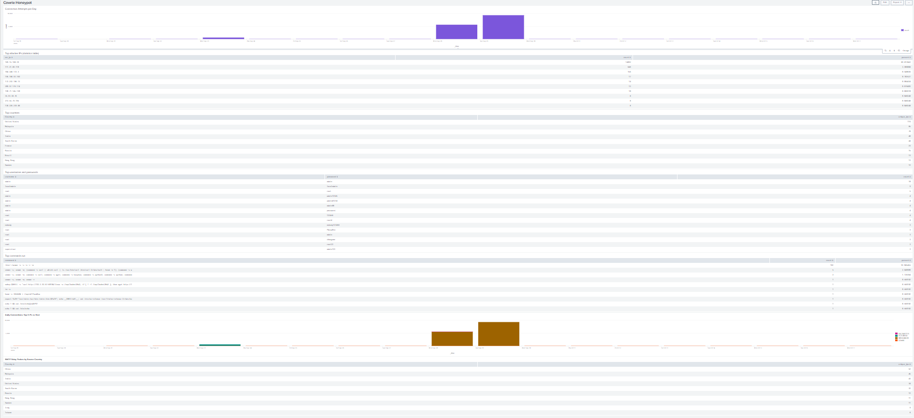
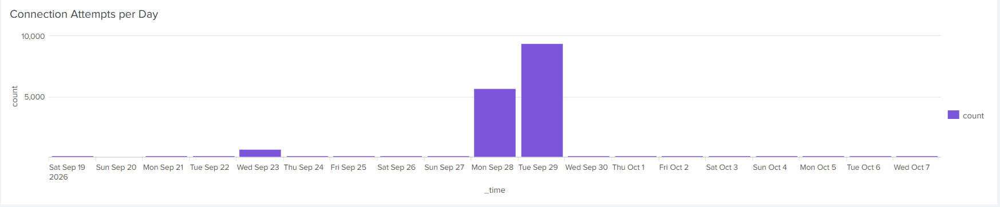
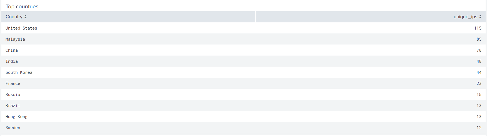
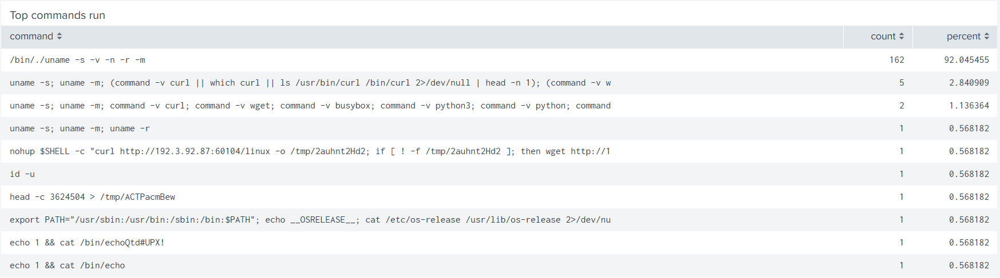

# Cloud Honeypot with Splunk SIEM

A cloud-hosted SSH honeypot (Cowrie) on AWS that logs real attacker activity, forwards it to a Splunk SIEM, and visualizes what the internet throws at an exposed server.

## Summary

I exposed a deliberately vulnerable SSH honeypot to the public internet for 17 days (Sep 19 to Oct 7, 2026) and analyzed the traffic in Splunk.

- 16,580 SSH connection attempts from 569 unique IPs
- One IP (189.15.188.39) generated about 90% of all connections, in two spikes on Sep 28 and 29
- 313 distinct IPs sent port-forwarding requests, all asking to reach the same mail server on port 25, consistent with probing for open proxies to relay spam
- Captured a malware dropper command (download, make executable, run) without any payload being saved or executed

## Architecture

Two AWS EC2 instances in us-east-2, each in its own security group:

| Instance | Role | Software |
|----------|------|----------|
| honeypot-cowrie | Exposed to the internet on port 2222 | Cowrie, Splunk Universal Forwarder |
| splunk-siem | Private, admin access from my IP only | Splunk Enterprise |

Cowrie writes every session to a JSON log. The Universal Forwarder watches that log and ships new events to Splunk over port 9997, restricted to the honeypot's private IP. Real admin SSH on the honeypot is restricted to my IP, so the exposed fake SSH service on 2222 is the only thing open to the world.

## Dashboard

The Splunk dashboard has seven panels: connections per day, top attacker IPs, top countries, top credentials, top commands, a daily chart split by the top 3 IPs, and SMTP relay probes by country.

## Findings

### 1. One bot caused most of the volume

Daily traffic was low and steady until two spikes on Sep 28 and Sep 29. A single IP (189.15.188.39) accounts for 14,892 of 16,580 connections, about 90%. A second chart that splits each day by source IP shows the spikes are almost entirely that one address. Without that breakdown, the raw totals would suggest a large coordinated attack when it was really one noisy source.

### 2. The real diversity is in the unique IPs

569 distinct IPs touched the honeypot. Counting unique IPs per country gives a more honest picture than counting connections, where one bot would make a single country look dominant. The United States leads, but many US addresses are cloud-hosted servers, so this reflects where the address is registered and not who is behind it.

### 3. Attackers log in with default credentials

The most common username and password pairs were admin/admin, localadmin/localadmin, and root/root, followed by variations like Admin12345, password, changeme, and admin123. This is typical credential guessing against default and weak passwords. Cowrie accepts nearly every login by design, so a successful login means the honeypot let the bot in, not that anything was breached.

### 4. What attackers do after logging in

After filtering out a connectivity probe that made up most of the raw commands, about 92% of the remaining commands were `uname`, which checks the operating system and architecture (MITRE T1082, System Information Discovery). Other commands checked whether `curl`, `wget`, `busybox`, or `python3` were installed, which tells the bot how it can download files.

One session attempted a download-and-execute chain: it fetched a file from a remote server with `curl`, fell back to `wget` if that failed, then tried to run it (MITRE T1105, Ingress Tool Transfer). The remote server was 192[.]3[.]92[.]87. Cowrie logged the command but saved no file, so there is no payload to analyze. I did not contact or scan that address.

### 5. A second behavior: SMTP relay probing

437 port-forwarding requests came from 313 distinct IPs, and every one asked for the same destination: 77[.]88[.]21[.]158 on port 25 (SMTP). Most senders made only a handful of requests and never ran commands. This is consistent with scanners testing for open proxies that could be used to relay spam (MITRE T1090, Proxy). The intent is inferred from the port, since Cowrie logs the request but does not carry it out.
